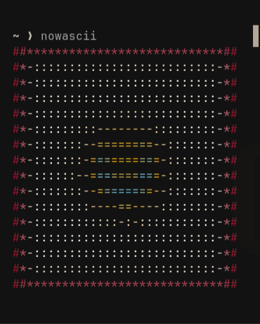
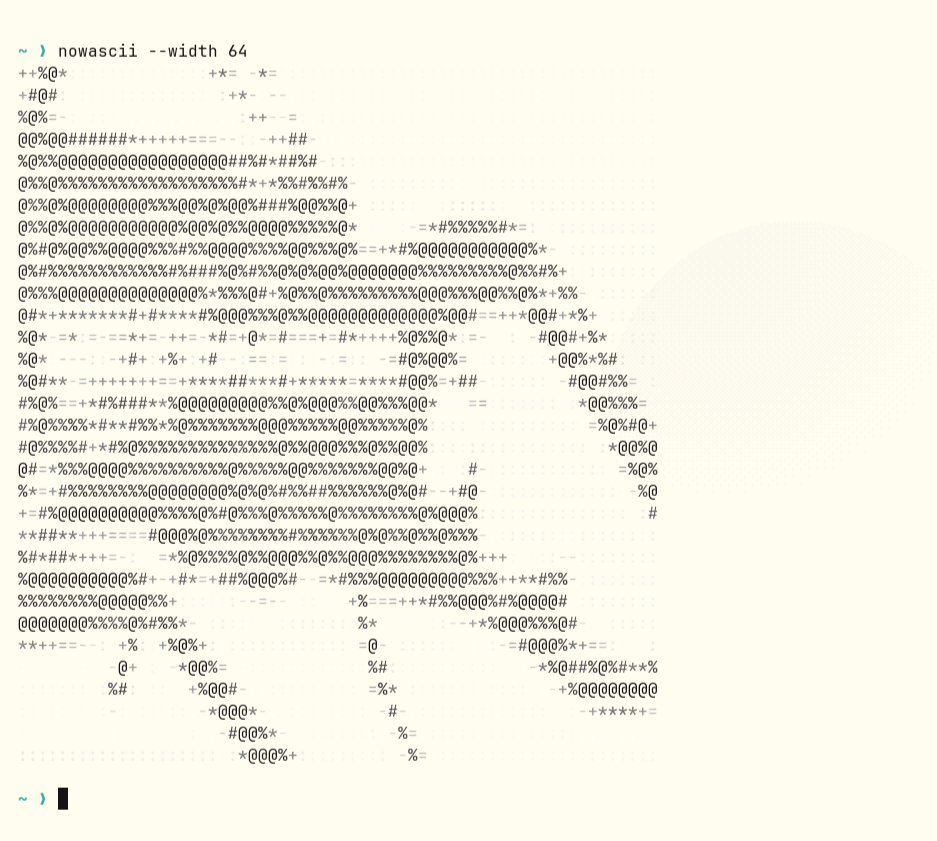

# nowascii

Print the album cover for the track playing on your Linux desktop as colored ASCII art.

`nowascii` reads the current track and cover URL from MPRIS, then draws the cover in your terminal.

## Examples

<table>
  <tr>
    <th>Dark terminal</th>
    <th>Light terminal</th>
  </tr>
  <tr>
    <td></td>
    <td></td>
  </tr>
</table>

## Install

Prebuilt release binaries are available for x86_64 Linux on the [Releases page](https://github.com/pneftekin/nowascii/releases/latest). Install `curl` with your distro's package manager if you don't already have it:

| Distribution | Install curl |
| --- | --- |
| Arch | `sudo pacman -S curl` |
| Debian / Ubuntu | `sudo apt install curl` |
| Fedora | `sudo dnf install curl` |
| openSUSE | `sudo zypper install curl` |

Then download and install the binary:

```sh
curl -fL https://github.com/pneftekin/nowascii/releases/latest/download/nowascii-linux-x86_64 -o /tmp/nowascii
sudo install -Dm755 /tmp/nowascii /usr/local/bin/nowascii
```

Run it while a track is playing:

```sh
nowascii
nowascii --width 48
```

The default width is 32 characters. The height is adjusted for typical terminal fonts so the art looks square. Only the artwork is printed; errors go to stderr.

## Build from source

Install Rust and Cargo, then run:

```sh
git clone https://github.com/pneftekin/nowascii.git
cd nowascii
cargo run --release -- --width 40
```

To install the command for your user:

```sh
cargo install --path .
```

Cargo installs it to `~/.cargo/bin`. Add that directory to `PATH` if needed. This also works on ARM Linux, provided Rust is available for your system.

## Requirements

- A Linux desktop session with a D-Bus session bus.
- A media player that exposes MPRIS track metadata and album art.
- A terminal with 24-bit ANSI color support.

Remote cover URLs require network access. Local `file://` covers work offline.

## Troubleshooting

- If no player is found, start playback in an MPRIS-compatible player and run `nowascii` from the same desktop session.
- Some players or tracks don't provide a cover URL; `nowascii` will report that when it happens.
- If colors look wrong, check that your terminal supports 24-bit ANSI color.

## License

MIT. See [LICENSE](LICENSE).
